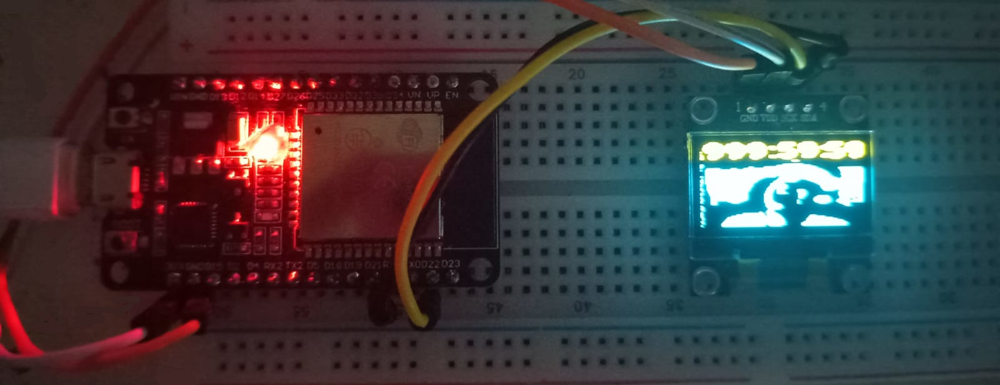

# Meiaclock ESP32

É um protótipo de projeto chamado "meiaclock" para acompanhar o timer da subathon do [Meiaum](https://www.twitch.tv/omeiaum) em formato de "relógio digital".

> É útil? Não, é só abrir a live. É divertido possuir um meiaclock? Sim.



## Hardware necessário

- **ESP-WROOM-32** ([**link**](https://produto.mercadolivre.com.br/MLB-2860521829-placa-esp32-pino-soldado-wifi-bluetooth-com-esp32-wroom-32-_JM#position%3D7%26search_layout%3Dgrid%26type%3Ditem%26tracking_id%3Dbbe17ad6-7576-411a-bbe2-36c74bee9b6c))
- **DISPLAY OLED SSD1306** ([**link**](https://produto.mercadolivre.com.br/MLB-3892633142-modulo-display-oled-tela-096-i2c-ssd1306-lcd-arduino-pic-_JM#position%3D8%26search_layout%3Dgrid%26type%3Ditem%26tracking_id%3D961fbed5-86bb-4f01-b51e-4b6e587b63c5))

## Software necessário

- É utilizado o projeto [esp-rs](https://github.com/esp-rs) cujo é uma série de repositórios em Rust relacionados ao ESP32. Principalmente aos bindings do [esp-idf](https://docs.espressif.com/projects/esp-idf/en/stable/esp32/index.html), que é o framework oficial em C.

- Instale todas as dependências descritas [aqui](https://github.com/esp-rs/esp-idf-template?tab=readme-ov-file#prerequisites)

## Tutorial

> [!IMPORTANT]
> Para o projeto compilar corretamente, faz-se necessário a configuração de algumas variáveis de ambiente específicas descritas abaixo

- No linux, você pode definir assim:
```bash
export VAR=VALUE
```
1. `API_URL` - A API oficial da subathon é pública: https://subathon-api.justdavi.dev/api/time-left (criada pelo dev davi)
2. `SSID` - O nome da sua rede wifi
3. `PASSWORD` - A senha da sua rede wifi
4. `SDA_PIN` - GPIO para o pino de `SDA` na comunicação [I2C](https://www.circuitbasics.com/basics-of-the-i2c-communication-protocol/)
5. `SCL_PIN` - GPIO para o pino de `SCL` na comunicação [I2C](https://www.circuitbasics.com/basics-of-the-i2c-communication-protocol/)

> No ESP-WROOM-32 informado acima:
> `GPIO 21` -> `SDA` |
> `GPIO 22` -> `SCL`

```bash
git clone https://github.com/febits/meiaclock-esp32
```
```bash
cd meiaclock-esp32
```
```bash
cargo build --release
```
```bash
espflash flash --monitor target/xtensa-esp32-espidf/release/meiaclock-esp32
```
- Se você instalou o `espflash` via `cargo install`, não se esqueça de adicionar à sua variável de ambiente `$PATH` o diretório `~/.cargo/bin/` para o shell conseguir achar o `espflash`.

- Se as variáveis de ambiente estiverem corretas (junto com as condições ideais de temperatura e pressão) e as conexões com os pinos estiverem corretas, o timer do menininho deve aparecer na sua tela.

- Lembrando que qualquer erro tratável será enviado para o monitor serial, cujo é ativado logo após o `flash` ser realizado na placa.

> [!NOTE]
> O timer do display atualiza em uma janela de 20 segundos para não sobrecarregar o servidor da API com muitos requests por minuto. A taxa de requests agora é 3 por minuto, ao invés de 60. Também há o fato de que o timer da própria subathon não atualiza com tanta frequência, então não há necessidade de fazer tantos requests.
